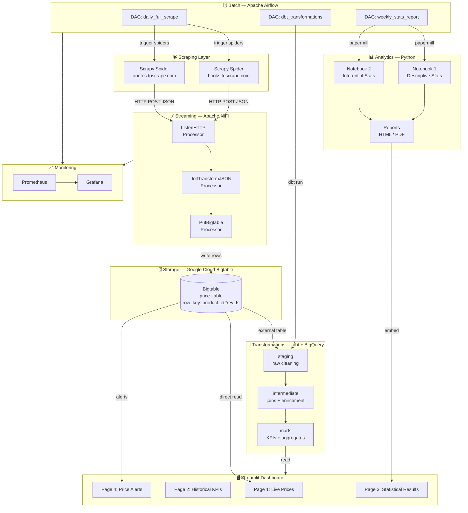
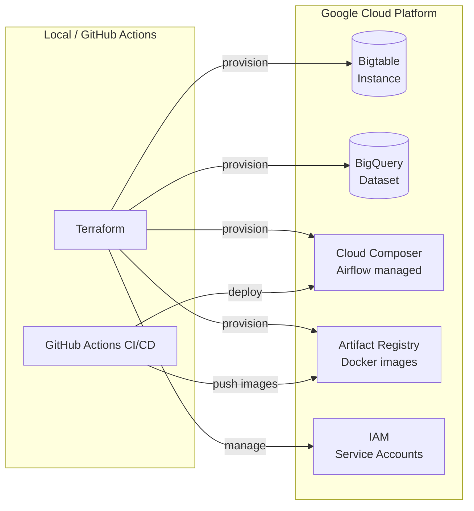

# Architecture — Real-Time E-commerce Price Intelligence Platform

## Overview

This platform monitors e-commerce prices in real-time and in batch using a hybrid
Lambda-style architecture: streaming events flow through Apache NiFi, while
daily batch jobs are orchestrated by Apache Airflow. All data lands in Google
Cloud Bigtable (time-series optimised storage), is transformed by dbt via BigQuery
external tables, and served through a Streamlit dashboard.

---

## Full Data Flow



---

## Component Details

### Row Key Design (Bigtable)

```
product_id#reversed_timestamp
Example: books_0001#9999999999999-1745000000000
```

Using a reversed timestamp ensures the most recent data is at the top of
each row group, which optimises range scans for "latest N prices".

### Column Families

| Family | Columns | TTL |
|---|---|---|
| `price_cf` | `current_price`, `original_price`, `currency`, `discount_pct` | 90 days |
| `metadata_cf` | `title`, `category`, `rating`, `url`, `source` | forever |
| `agg_cf` | `avg_7d`, `avg_30d`, `min_30d`, `max_30d`, `volatility` | 30 days |

### dbt Model Layers

```
staging/
  stg_bigtable_prices.sql        -- raw → typed, renamed columns
  stg_bigtable_metadata.sql

intermediate/
  int_prices_with_metadata.sql   -- join price + metadata
  int_daily_price_stats.sql      -- daily aggregates per product

marts/
  mart_price_kpis.sql            -- final KPI table for dashboard
  mart_price_alerts.sql          -- products with >5% change in 24h
  mart_category_comparison.sql   -- cross-category stats
```

---

## Infrastructure (GCP — Phase 9)



---

## Phase Roadmap

| Phase | Description | Status |
|---|---|---|
| 0 | Bootstrap — repo structure, Docker skeleton | ✅ Done |
| 1 | Scrapy spiders (books + quotes) | ⬜ |
| 2 | Bigtable emulator + schema | ⬜ |
| 3 | NiFi streaming ingestion | ⬜ |
| 4 | Airflow batch orchestration | ⬜ |
| 5 | dbt transformations | ⬜ |
| 6 | Statistical analytics notebooks | ⬜ |
| 7 | Streamlit dashboard | ⬜ |
| 8 | DataOps: CI/CD, GE, Prometheus | ⬜ |
| 9 | GCP deployment (Terraform) | ⬜ |
| 10 | Final deliverables + demo | ⬜ |
