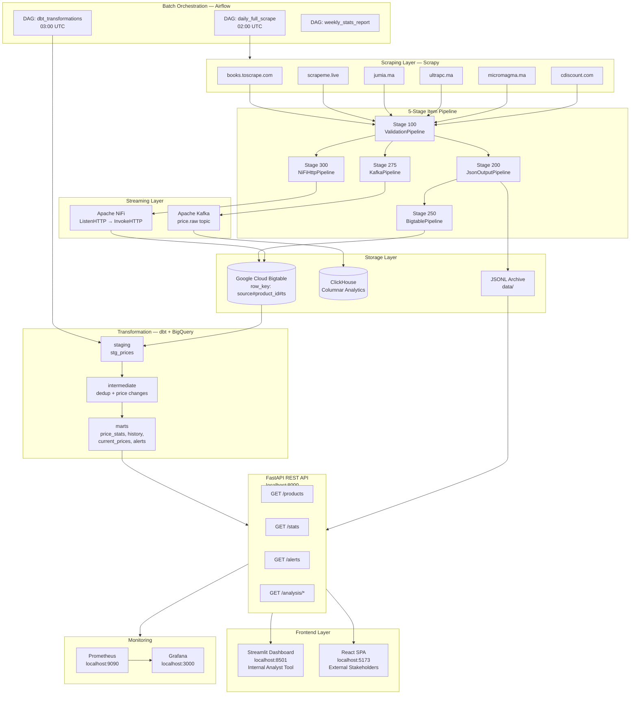
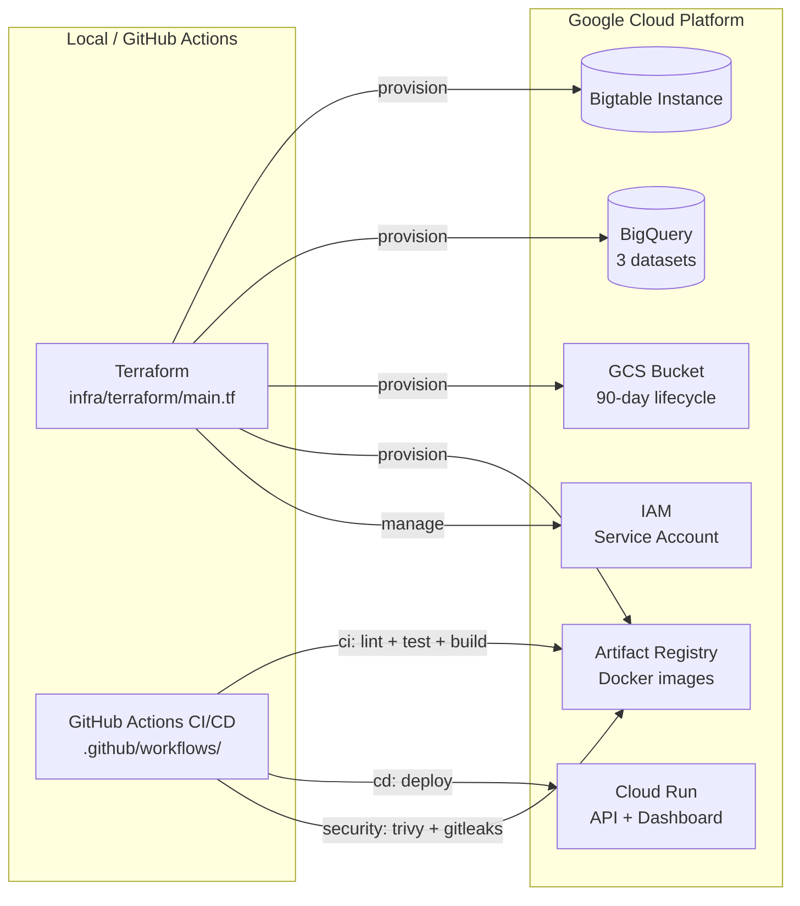

# Architecture — Real-Time E-commerce Price Intelligence Platform

## Overview

This platform monitors e-commerce prices in real-time and in batch using a hybrid
Lambda-style architecture: streaming events flow through Apache Kafka and NiFi,
daily batch jobs are orchestrated by Apache Airflow, data is stored in Google Cloud
Bigtable and ClickHouse, transformed by dbt via BigQuery, and served through a
FastAPI REST layer powering both a Streamlit analyst dashboard and a React SPA.

---

## Full Data Flow


```mermaid
flowchart TD
    subgraph Scraping["Scraping Layer — Scrapy"]
        S1[books.toscrape.com]
        S2[scrapeme.live]
        S3[jumia.ma]
        S4[ultrapc.ma]
        S5[micromagma.ma]
        S6[cdiscount.com]
    end

    subgraph Pipeline["5-Stage Item Pipeline"]
        P1[Stage 100\nValidationPipeline]
        P2[Stage 200\nJsonOutputPipeline]
        P3[Stage 250\nBigtablePipeline]
        P4[Stage 275\nKafkaPipeline]
        P5[Stage 300\nNiFiHttpPipeline]
        P1 --> P2 --> P3
        P1 --> P4
        P1 --> P5
    end

    subgraph Streaming["Streaming Layer"]
        K[Apache Kafka\nprice.raw topic]
        N[Apache NiFi\nListenHTTP → InvokeHTTP]
    end

    subgraph Orchestration["Batch Orchestration — Airflow"]
        A1[DAG: daily_full_scrape\n02:00 UTC]
        A2[DAG: dbt_transformations\n03:00 UTC]
        A3[DAG: weekly_stats_report]
    end

    subgraph Storage["Storage Layer"]
        BT[(Google Cloud Bigtable\nrow_key: source#product_id#ts)]
        CH[(ClickHouse\nColumnar Analytics)]
        JSONL[JSONL Archive\ndata/]
    end

    subgraph Transform["Transformation — dbt + BigQuery"]
        D1[staging\nstg_prices]
        D2[intermediate\ndedup + price changes]
        D3[marts\nprice_stats, history,\ncurrent_prices, alerts]
        D1 --> D2 --> D3
    end

    subgraph API["FastAPI REST API\nlocalhost:8000"]
        E1[GET /products]
        E2[GET /stats]
        E3[GET /alerts]
        E4[GET /analysis/*]
    end

    subgraph Frontend["Frontend Layer"]
        ST[Streamlit Dashboard\nlocalhost:8501\nInternal Analyst Tool]
        RE[React SPA\nlocalhost:5173\nExternal Stakeholders]
    end

    subgraph Monitoring["Monitoring"]
        PR[Prometheus\nlocalhost:9090]
        GR[Grafana\nlocalhost:3000]
        PR --> GR
    end

    S1 & S2 & S3 & S4 & S5 & S6 --> P1
    P3 --> BT
    P4 --> K
    P5 --> N
    P2 --> JSONL
    K --> CH
    N --> BT
    A1 --> Scraping
    A2 --> D1
    BT --> D1
    D3 --> API
    JSONL --> API
    API --> ST
    API --> RE
    API --> Monitoring
```

---

## Component Details

### Scrapy Item Pipeline (5 stages)

| Stage | Class | Action |
|---|---|---|
| 100 | `ValidationPipeline` | Drop items with missing fields, non-numeric or negative price |
| 200 | `JsonOutputPipeline` | Append to `data/<spider>/<spider>_<timestamp>.jsonl` |
| 250 | `BigtablePipeline` | Write to Bigtable — row key `{source}#{product_id}#{scraped_at}` |
| 275 | `KafkaPipeline` | Publish JSON to `price.raw` Kafka topic |
| 300 | `NiFiHttpPipeline` | POST to NiFi ListenHTTP (port 9191) → Sink microservice |

### Row Key Design (Bigtable)

```
{source}#{product_id}#{scraped_at}
Example: books.toscrape.com#book_0001#2025-01-15T02:00:00Z
```

Range scans for "all price history of product X" are efficient because
all rows for a product are contiguous in lexicographic order.

### Column Families (Bigtable)

| Family | Columns | TTL |
|---|---|---|
| `price_cf` | `current_price`, `currency`, `discount_pct` | 90 days |
| `metadata_cf` | `title`, `category`, `rating`, `url`, `source` | forever |

### dbt Model Layers

```
staging/
  stg_prices.sql                   -- clean types, trim whitespace, filter min_price

intermediate/  (ephemeral)
  int_prices_deduped.sql           -- ROW_NUMBER() dedup — latest scrape per product/day
  int_price_changes.sql            -- LAG() price_change_pct + price_change_abs

marts/  (materialised tables)
  mart_price_stats.sql             -- per-source avg, median, std, min, max
  mart_price_history.sql           -- one row per product per day + change
  mart_current_prices.sql          -- latest price per product
  mart_price_alerts.sql            -- products with >= 5% price drop
```

### FastAPI Endpoints

| Method | Path | Description |
|---|---|---|
| GET | `/health` | Liveness probe |
| GET | `/products` | Paginated product list, filterable by source/category/price |
| GET | `/stats` | Per-source statistics from `mart_price_stats` |
| GET | `/history/{product_id}` | Price over time from `mart_price_history` |
| GET | `/alerts` | Price drops from `mart_price_alerts` |
| GET | `/api/v1/analysis/descriptive` | Mean, median, std, skew, kurtosis per source |
| GET | `/api/v1/analysis/tests` | Shapiro-Wilk, ANOVA, Kruskal-Wallis, Mann-Whitney, 95% CI |
| GET | `/api/v1/analysis/histogram` | Log-scale price histogram per source |
| GET | `/api/v1/analysis/regression` | OLS price ~ rating, scatter data, per-source regression |

---

## Infrastructure (GCP)


```mermaid
flowchart LR
    subgraph GCP["Google Cloud Platform"]
        BT2[(Bigtable Instance)]
        BQ[(BigQuery\n3 datasets)]
        GCS[GCS Bucket\n90-day lifecycle]
        AR[Artifact Registry\nDocker images]
        CR[Cloud Run\nAPI + Dashboard]
        IAM[IAM\nService Account]
    end

    subgraph Local["Local / GitHub Actions"]
        TF[Terraform\ninfra/terraform/main.tf]
        GH[GitHub Actions CI/CD\n.github/workflows/]
    end

    TF -->|provision| BT2
    TF -->|provision| BQ
    TF -->|provision| GCS
    TF -->|provision| AR
    TF -->|manage| IAM
    GH -->|ci: lint + test + build| AR
    GH -->|cd: deploy| CR
    GH -->|security: trivy + gitleaks| AR
```

### Kubernetes Manifests (k8s/)

| File | Purpose |
|---|---|
| `namespace.yaml` | Isolate all resources in `price-intelligence` namespace |
| `configmap.yaml` | Externalise all env vars — no credentials in code |
| `api-deployment.yaml` | Rolling deploy with `/health` liveness + readiness probes |
| `dashboard-deployment.yaml` | Rolling deploy with `/_stcore/health` probe |
| `scraper-cronjob.yaml` | Kubernetes CronJob at `0 2 * * *` |
| `ingress.yaml` | Nginx ingress: `/api` → FastAPI, `/` → Streamlit |

---

## Phase Roadmap

| Phase | Description | Status |
|---|---|---|
| 0 | Bootstrap — repo structure, Docker skeleton | Done |
| 1 | Scrapy spiders (6 sources) + 5-stage pipeline | Done |
| 2 | Bigtable schema + ClickHouse schema | Done |
| 3 | NiFi streaming ingestion + Kafka consumer | Done |
| 4 | Airflow batch orchestration (3 DAGs) | Done |
| 5 | dbt transformations (3-layer, 4 marts) | Done |
| 6 | Statistical analytics (descriptive + inferential notebooks) | Done |
| 7 | Streamlit dashboard (4 pages) + React SPA | Done |
| 8 | DataOps: CI/CD, data quality, Prometheus/Grafana | Done |
| 9 | GCP deployment (Terraform + Cloud Run + Kubernetes) | Done |
| 10 | Final deliverables + presentation | Done |
